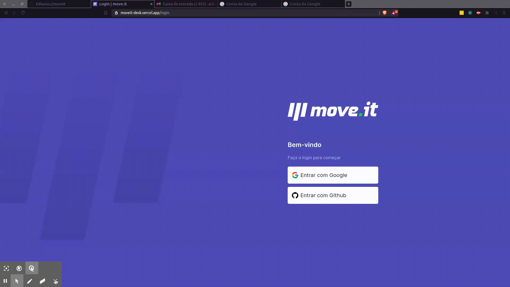

<h1 align="center"> 
</h1>
<h4 align="center">🚀 Next Level Week #4 - ReactJs (Rocketseat)</h4>

</br>

<p align="center">
<a href="#books-technologies">Technologies</a>&nbsp;&nbsp;&nbsp;|&nbsp;&nbsp;&nbsp;
<a href="#-project">Project</a>&nbsp;&nbsp;&nbsp;|&nbsp;&nbsp;&nbsp;
<a href="#gear-getting-started">Getting Started</a>&nbsp;&nbsp;&nbsp;|&nbsp;&nbsp;&nbsp;
<a href="#rocket-deploy-on-vercel">Deploy on Vercel</a>&nbsp;&nbsp;&nbsp;|&nbsp;&nbsp;&nbsp;
  <a href="#memo-license">License</a>
</p>
<hr/>

</br>
<p align="center">

</p>
</br>

## :books: Technologies

This project was developed with the following technologies:

- [Node.js](https://nodejs.org/en/)
- [React](https://reactjs.org)
- [Next.js](https://nextjs.org/)
- [Docker](https://www.docker.com/)
- [MongoDB](https://www.mongodb.com/)
- [Typescript](https://www.typescriptlang.org/)

## 💻 Project

<p>When you work for a long time in front of a screen, you have to make sure that you don't start having problems with your eyes and body while working. Therefore, you need some time to relax and do some exercise.</p>

<p>Moveit is a platform that control your or your team work cycle and offers some challenges that you or each member of your team can do individually in a few minutes at the end of each cycle.</p>

## :gear: Getting Started

To run this application you will need to install: [Git](https://git-scm.com), [Docker](https://www.docker.com/) and [Node.js](https://nodejs.org/en/) + [Yarn](https://yarnpkg.com/).

First, clone the repository:
```bash
  git clone https://github.com/EdlanioJ/moveit.git

  cd moveit
```

After, create the Google  OAuth credentials and the Github OAuth App, follow instructions on the links below:

- [Creating Google  OAuth Credentials Video](https://www.youtube.com/watch?v=xH6hAW3EqLk)
- [Creating Github OAuth App Video](https://www.youtube.com/watch?v=R9lxXQcy-nM)

Then create a file ```.env.local``` with variables inside the [.env.example](.env.example) and fill all variables.

Using Docker

Run:

```bash
  docker-compose up -d
```

Not using Docker

Create your mongo database and replace ```MONGODB_URI``` value inside ```.env.local``` with your database link.

Run:
```bash
  yarn install
  yarn dev

  or

  npm install
  npm run dev
```
Open [http://localhost:3000](http://localhost:3000) with your browser to see the result.
## :rocket: Deploy on Vercel

The easiest way to deploy your Next.js app is to use the [Vercel Platform](https://vercel.com/new?utm_medium=default-template&filter=next.js&utm_source=create-next-app&utm_campaign=create-next-app-readme) from the creators of Next.js.

Check out our [Next.js deployment documentation](https://nextjs.org/docs/deployment) for more details.


## :memo: License

This project is under the MIT license. See the archive [LICENSE](LICENSE.md) for more details.

Made with ♥ by Edlânio Júlio.